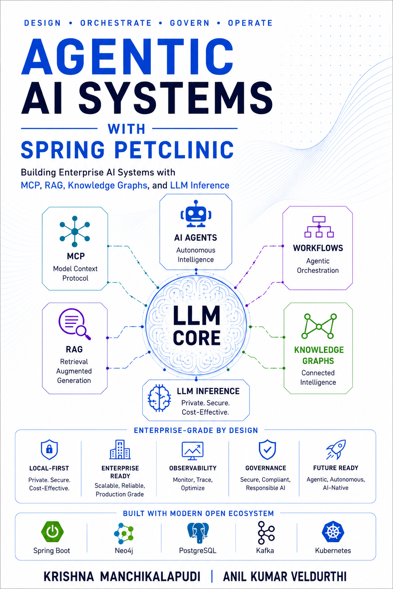
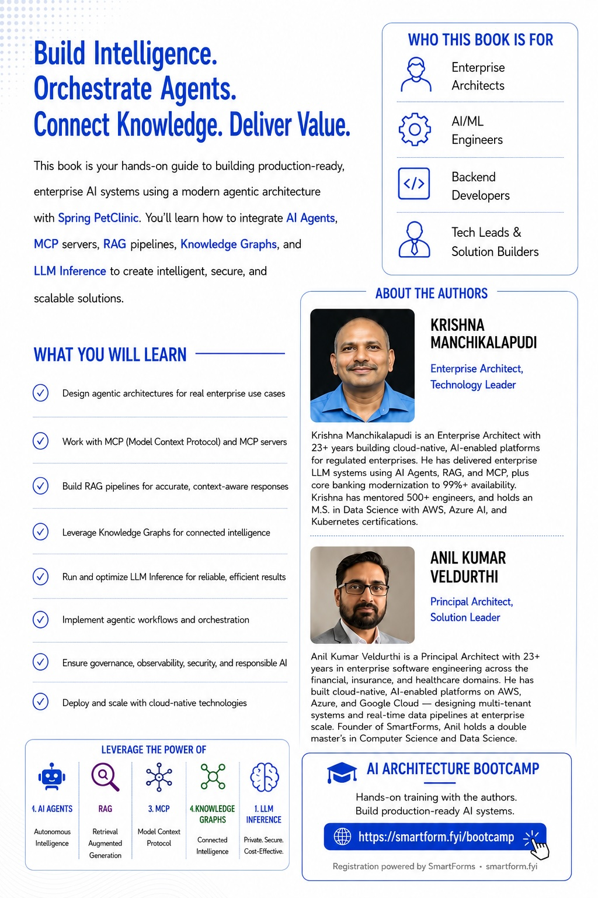
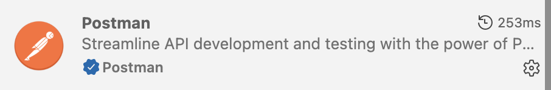
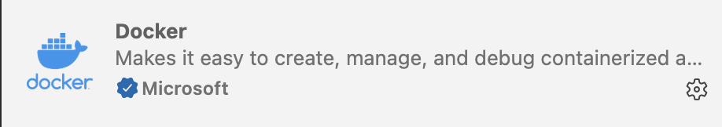
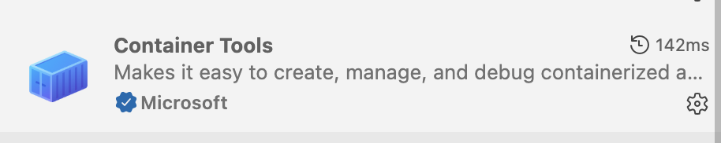
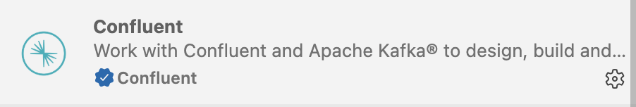
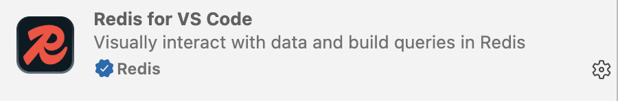
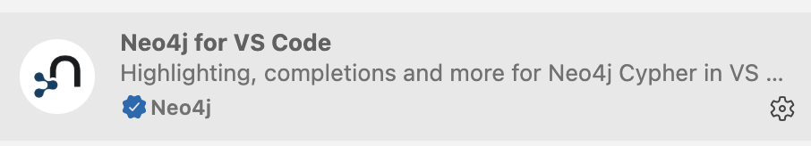
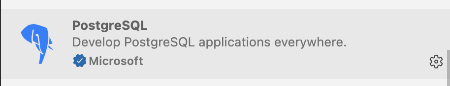
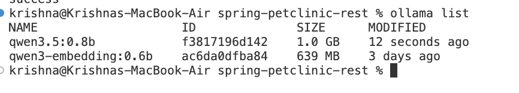

# BOOTCAMP: Agentic AI Systems with Spring PetClinic

This bootcamp is a linear hands-on upgrade path for the Spring Petclinic REST API.
The flow starts with local setup, then moves into API exploration, MCP integration,
agent workflows, SKILL-based automation, and finally optional retrieval with local embeddings.

<a href="https://a.co/d/04n6VGZM" target='_new'>
<table>
<tr>
<td></td>
<td></td>
</tr>
</table>
</a>

The target stack for the labs is:
- <a href="https://openjdk.org/projects/jdk/25/" target="_new">OpenJDK 25</a>
- <a href="https://maven.apache.org/download.cgi" target="_new">Apache Maven 3.x</a>
- <a href="https://ollama.com" target="_new">Ollama local inference</a>
  - <a href="https://ollama.com/library/qwen3.5:0.8b" target="_new">Qwen3.5:0.8b for chat and tool use</a>
  - <a href="https://ollama.com/library/qwen3-embedding:0.6b" target="_new">qwen3-embeddings only when semantic search or vector lookup is needed</a>
- <a href="https://www.docker.com/products/docker-desktop/" target="_new">Docker Desktop</a>

## Prerequisites for BOOTCAMP

**Before Day 1 — participants must have:**
- Validate prereq stack
- Run the default app
- IDE `VS Code` with extensions: 
    - Postman
    
    - Docker
    
    - Container Tools
    
    - Kafka
    
    - Redis
    
    - Neo4J
    
    - Postgres
    

- Ollama installed: `curl -fsSL https://ollama.ai/install.sh | sh`
    - Models pre-pulled (do this before arrival — ~1.25GB total):
  ```bash
  ollama pull qwen3.5:0.8b
  ollama pull nomic-embed-text
  ```


- Clone the starter repo:
```bash
  git clone https://github.com/krishnamanchikalapudi/bootcamp-spring-petclinic-rest.git
```


## Schedule: Bootcamp Goal
By the end of day 2, participants should be able to:
- run the default Petclinic REST app locally
- expose the app as a tool-enabled local integration target
- connect the API to MCP-based workflows
- build agentic flows that inspect, decide, and act on REST endpoints
- add SKILL-driven repeatable workflows for common tasks
- use embeddings and a vector database only when the exercise requires knowledge retrieval

### Day 1

#### Session 1: Local Setup and Default App Run
- Establishes the runtime, tooling, and baseline app.

#### Session 2: REST API Discovery and First MCP Wiring
- Continues with API exploration and the first MCP wiring.

#### Session 3: First Agent for REST Operations
- Ends with a simple agent that can inspect and summarize the API.

### Day 2

#### Session 4: Agentic AI Patterns for Multi-Step Work
- Moves from a simple agent to a multi-step agentic workflow.

#### Session 5: MCP with SKILL for Repeatable Workflows
- Adds SKILLs for repeatable operations and guided execution.

#### Session 6: Embeddings and Vector Database
- Closes with embeddings and vector search for local knowledge retrieval.


## Environment Setup Reference

### Clone repo
```bash
git clone https://github.com/krishnamanchikalapudi/spring-petclinic-rest.git
cd spring-petclinic-rest
```

### Full stack
 - Services: 
  - PostgreSQL + pgvector
  - Neo4j
  - Redis
  - Kafka,
  - Prometheus
  - Grafana
  - Langfuse

### Verify all services
```bash
docker-compose -f ./BOOTCAMP/docker-compose-bootcamp.yml ps
curl http://localhost:8080/actuator/health
curl http://localhost:7474   # Neo4j Browser
curl http://localhost:3000   # Grafana (admin/petclinic)
curl http://localhost:3100   # Langfuse
curl http://localhost:9090   # Prometheus
curl http://localhost:11434/api/tags  # Ollama
```

## References
- Docker images: https://hub.docker.com/repository/docker/krishnamanchikalapudi/spring-petclinic-rest
- [Spring Petclinic REST documentation](https://spring-petclinic.github.io/docs/)
- [Main project README](../readme.md)
